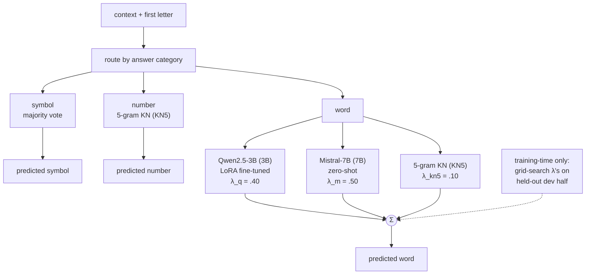

# Predictive Keyboard

Given a left context and the first letter of the next word, predict the word.
Contest project: n-gram + LLM blending for next-word prediction.

Full writeup (data, methods, results, negative results): [`report/final_report.pdf`](report/final_report.pdf)
(source: `report/final_report.tex`). Working notes from each phase: `report/report.md`
(official split) and `report/old_report.md` (an earlier, discarded data split, kept for
methodologically-still-valid findings like the corpus-cleaning test).

Final held-out result: **78.60% overall / 76.09% word accuracy** (±0.8pt, 95% CI).

## Final architecture

Every row is routed by its answer's category, decided from the given first letter:

- **symbol** (~10% of rows): near-fully deterministic from the first letter alone
  (~99.6% majority-vote ceiling) — no model needed.
- **number** (~2%): true values are anonymized to digit-length placeholders, so this
  is a digit-length classification problem, not text generation. Handled by a KN5
  n-gram trained only on number-containing lines (train + Gigaword, vocab-masked).
- **word** (~88%, the main task): candidates from Qwen2.5-3B (LoRA fine-tuned) and
  Mistral-7B-v0.1 (zero-shot) are teacher-forced-scored on a shared candidate set
  (beam top-k ∪ n-gram top-10), blended with a general-purpose KN5 5-gram. Blend
  weights are grid-searched once on a held-out dev half, then fixed for inference.

See `report/final_report.pdf` §II–III for the full model comparisons (n-gram order
ablations, zero-shot model shortlist, rerankers tried and rejected, blend ablations)
and the complete results table.

## Repo layout

- `report/` — the report (`.tex` + `.pdf`) and the two working-notes documents it's
  sourced from.
- `scripts/` — n-gram training/inference, candidate generation, teacher-forced
  scoring, blending, reranker experiments.
- `tools/` — KenLM binaries (`lmplz`, `build_binary`, `query`).
- `num/` — number-category baselines (naive Bayes / logistic regression comparisons).
- `eda/` — exploratory data analysis notebooks.
- `kaggle/` — notebooks used for the Kaggle-side inference runs (Mistral scoring,
  full-pipeline inference).
- `data/`, `weights/` — corpora and trained model artifacts (gitignored, not tracked).
