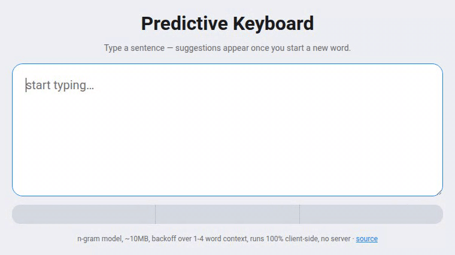
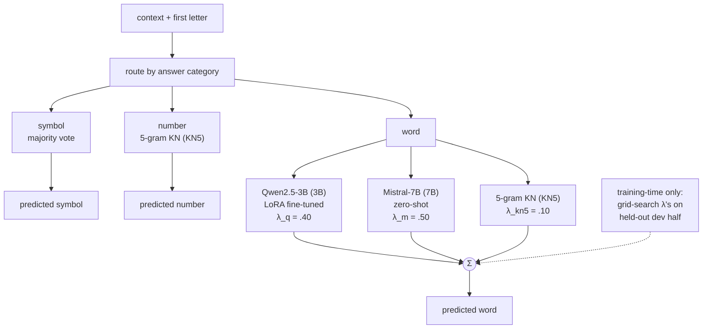

# Predictive Keyboard

Given a left context and the first letter of the next word, predict the word. A LoRA
fine-tuned Qwen2.5-3B is blended with a zero-shot Mistral-7B and a KenLM 5-gram
(scalar-λ, grid-searched on pooled 5-fold CV) for the main word task, with a second
KenLM trained on external Gigaword data just for the number category, and a separate
trie-compressed n-gram running entirely in the browser for the live demo.

**[Live demo](https://t6523.github.io/predictive_keyboard/)** · PyTorch · Unsloth/PEFT
LoRA · KenLM · n-gram (from scratch) · vanilla JS (client-side inference)

<p align="center"></p>

## Highlights

- **Full pipeline: 78.60% overall / 76.09% word accuracy** on the held-out test set
  (±0.8pt, 95% CI) — up from a 55.51% word / 60.12% overall n-gram-only baseline.
- **LoRA fine-tuned Qwen2.5-3B** (r=16, α=32, q/k/v/o_proj, via Unsloth) on a Kaggle T4,
  ~8h wall-clock across 2 sessions, plain packed-sequence causal-LM objective — the
  first-letter constraint lives entirely in an inference-time logit mask, not the
  training data.
- **3-way blend** (Qwen teacher-forced + Mistral-7B zero-shot + KenLM 5-gram,
  grid-searched λ) was the single biggest gain of the whole project: **+2.02pt word**
  over the 2-way blend — architecturally, Mistral ends up weighted *more* than Qwen in
  the blend despite scoring lower solo, because its errors are more decorrelated.
- **Number category gets its own model**: a second KenLM trained on 606M tokens pulled
  from Gigaword (external to the main 130M-token training corpus) plus the train set's
  own number-containing lines, +2.62pt over routing numbers through the general n-gram.
- **8 zero-shot base models benchmarked**, 2 rerankers tried and rejected, 1 learned
  blender tried and rejected, 1 four-way blend candidate tried and rejected — every
  one of those is a real measured result, not a guess (see **Engineering log** below).
- **The n-gram also runs as a live, client-side predictive keyboard**: trie-compressed
  to ~10MB gzip, no server, 70% top-3 word-in-top-3 accuracy on its own.

## Results

Dev-set numbers below are pooled 5-fold stratified CV on 9,448 rows (every row held
out exactly once), unless noted. The final 78.60%/76.09% is the true held-out test set.

| stage | word | overall |
|---|---|---|
| n-gram only (baseline) | 55.51% | 60.12% |
| fine-tuned Qwen2.5-3B alone (beam k=5) | 69.72% | — |
| 2-way blend: Qwen (teacher-forced) + KN5 | 72.62% | 75.42% |
| 3-way blend: + Mistral-7B zero-shot | 74.64% | 77.18% |
| + continued fine-tune, widened candidates (k=10 beam) | 75.09% | 77.68% |
| + number-specific KN5 (external Gigaword data) | — | 77.29% |
| **final, held-out test set** | **76.09%** | **78.60%** |

Full model-comparison tables (zero-shot shortlist, reranker/blender rejections, ablations)
are in `report/final_report.pdf` §II–III and `report/report.md`.

## How it works

Every row is routed by its answer's category, decided from the given first letter:


```mermaid
flowchart TD
    A["context + first letter"] --> B["route by answer category"]
    B --> S["symbol\nmajority vote"]
    B --> N["number\n5-gram KN (KN5)"]
    B --> W["word"]

    S --> PS["predicted symbol"]
    N --> PN["predicted number"]

    W --> Q["Qwen2.5-3B (3B)\nLoRA fine-tuned\nλ_q = .40"]
    W --> M["Mistral-7B (7B)\nzero-shot\nλ_m = .50"]
    W --> K["5-gram KN (KN5)\nλ_kn5 = .10"]

    Q --> SUM((Σ))
    M --> SUM
    K --> SUM
    SUM --> PW["predicted word"]

    T["training-time only:\ngrid-search λ's on\nheld-out dev half"] -.-> SUM
```

- **symbol** (~10% of rows): near-fully deterministic from the first letter alone
  (~99.6% majority-vote ceiling) — no model needed.
- **number** (~2%): true values are anonymized to digit-length placeholders (`1234` →
  `1111`), so this is a digit-length classification problem, not text generation.
  Routed through a KenLM 5-gram trained only on number-containing lines — the general
  n-gram and the LLMs both see this category too, but a model trained on *just*
  number contexts (including 606M tokens pulled from Gigaword, external to the main
  training corpus) does +2.62pt better than reusing the general-purpose model.
- **word** (~88%, the main task): candidates from Qwen2.5-3B (LoRA fine-tuned, teacher-
  forced scored) and Mistral-7B-v0.1 (zero-shot, teacher-forced scored) on a shared
  candidate set (beam top-k ∪ n-gram top-10), blended with a KenLM 5-gram. Blend
  weights are grid-searched once on held-out dev folds, then fixed for inference.

### Engineering log — what was tried, kept, or rejected

This project's main cost wasn't writing the blend — it was finding out which of many
plausible ideas actually helped, with a real measurement each time:

- **Base model selection**: picked by an actual zero-shot run on the real task (not a
  benchmark proxy — the initial pick by HellaSwag score, Mistral-7B, was overturned
  once measured directly). 8 models benchmarked zero-shot: Qwen2.5-3B (70.26% word)
  edged out Mistral-7B (69.92%), well ahead of granite-3.1-2b, gemma-2-2b, Qwen2.5-1.5B
  (~68%), Falcon3-3B, SmolLM2-1.7B, and phi-2 (~60%). A state-space model
  (mamba-2.8b, 65.55%) and a pure-RNN (RWKV-4-3b, 60.66%) were also checked for the
  2nd blend slot, specifically for architectural diversity, not solo accuracy.
- **Newer isn't always better**: Qwen3.5 (released after the original shortlist) was
  re-checked and rejected — lower word accuracy than Qwen2.5-3B *and* 2.5-4x slower in
  this environment (missing fast kernels for its linear-attention architecture).
- **Decoding-method artifacts caught before they misled a decision**: an early
  zero-shot-vs-fine-tuned comparison looked nearly flat because it mixed greedy
  decoding (zero-shot) against beam search (fine-tuned) — rerunning both through the
  identical beam-k5 protocol surfaced a real **+3.2pt** fine-tuning gain that the
  mismatched comparison had hidden.
- **Small-sample noise caught the same way**: a first λ-tuning pass on a single 80/20
  split found λ=0.90 at 72.50% word — looked great, turned out to be noise (±2pt at
  n=1640). Pooled 5-fold CV over all 9,448 rows replaced it with a trustworthy number.
- **Rejected: MiniLM cosine rerank** of the beam's top5 — **-11.4pt** word accuracy.
  Topical-similarity embeddings are blind to grammar/agreement/tense, exactly the
  signal the causal LM's own beam score already encodes.
- **Rejected: trained cross-encoder reranker** (MiniLM, listwise cross-entropy) — same
  failure mode, smaller loss (69.72% → 62.34%), still net-worse than the beam's own
  ranking. A reranker only sees the same left-context the LM already conditioned on.
- **Rejected: learned (GBDT) blender** in place of the scalar λ — flat to marginally
  worse (72.62% → 72.55% word) despite 7 features vs. 1. The extra features correlated
  too heavily with what the λ blend already captured.
- **Rejected: 4-way blend** adding a 3rd teacher-forced LLM (granite-3.1-2b) — didn't
  clear the pre-registered go/no-go bar (+0.3pt word), so it added a free parameter for
  nothing and was dropped before the full run.
- **Rejected: same-corpus number model** — a bag-of-words logistic regression/Naive
  Bayes number-length classifier trained on the *same* corpus the general n-gram
  already sees scored 48-54%, *worse* than the general n-gram. Confirms a model "for"
  a category only helps if it draws on genuinely new data (external Gigaword text),
  not just a same-corpus subset.
- **Kept, biggest single win: the 3-way blend** (+Mistral) at +2.02pt word — bigger
  than every other single change in the project, including the scorer swap, the
  teacher-forced rescoring change, and the learned-blender attempt combined.

## Quickstart

`requirements.txt` only covers the EDA/notebook stack (pandas, jupyter, matplotlib) —
the n-gram/blend scripts below are standard-library only except where noted, and all
of them assume `cwd = scripts/` (they reference data/weights as `../data`, `../weights`).

```bash
cd scripts

# train the n-gram (order-4, ~13min on the 3.8M-line corpus)
python3 train_ngram.py --n 4 --min-count 10 --out ../weights/ngram_4_a.bin

# evaluate it
python3 infer_ngram.py --model ../weights/ngram_4_a.bin --dev ../data/dev_set_final.csv

# KenLM 5-gram for the blend -- tools/{lmplz,build_binary} are already prebuilt and
# committed (scripts/build_kenlm.sh is only needed if those binaries don't run on your
# platform/arch); blend_ngram.py's KN5Scorer also needs `pip install kenlm` (the
# Python binding, not in requirements.txt)
../tools/lmplz -o 5 < ../data/train_final.src.tok > ../weights/kn5.arpa
../tools/build_binary ../weights/kn5.arpa ../weights/kn5.binary
pip install kenlm

# blend Qwen + Mistral + KN5 (needs qwen_tf_scores.csv / mistral_tf_scores.csv --
# generated on Kaggle via kaggle/qwen3b_train_infer.ipynb + score_candidates.py,
# which need torch/transformers/unsloth, not listed in requirements.txt either)
python3 blend3.py --qwen ../weights/qwen_tf_scores.csv \
    --mistral ../weights/mistral_tf_scores.csv --ngram ../weights/ngram_4_a.bin \
    --kn-model ../weights/kn5.binary

# export the browser demo's model assets, then serve docs/ locally
python3 build_release_assets.py --model ../weights/ngram_4_a.bin --out ../docs/data
cd .. && python3 -m http.server 8080 --directory docs
```

LoRA fine-tuning itself (`kaggle/qwen3b_train_infer.ipynb`) needs a GPU and Kaggle's
attached Qwen2.5-3B + corpus datasets — it's not a local `pip install` step. Most
scripts in `scripts/` (the blend/scoring/n-gram-inference ones, not `train_ngram.py` or
`build_release_assets.py`) have a `--demo` flag that runs a self-check with no model/
data files needed, e.g. `python3 export_demo_model.py --demo`.

## Project structure

- `report/` — the report (`.tex` + `.pdf`) and the two working-notes documents
  (`report.md`, `old_report.md`) it's sourced from.
- `scripts/` — n-gram training/inference, candidate generation, teacher-forced
  scoring, blending (`blend3.py`/`blend4.py`/`learned_blender.py`), reranker
  experiments, and the browser-demo export pipeline (`export_demo_model.py`,
  `build_release_assets.py`).
- `kaggle/` — the Kaggle notebooks that actually ran LoRA training and LLM inference
  (Qwen fine-tune, Mistral zero-shot, full-pipeline inference).
- `tools/` — KenLM binaries (`lmplz`, `build_binary`, `query`).
- `num/` — number-category baselines (naive Bayes / logistic regression), kept as a
  rejected-approach reference (see Engineering log above).
- `eda/` — exploratory data analysis notebooks.
- `docs/` — the live GitHub Pages demo: static HTML/JS/CSS plus the exported n-gram
  trie + vocab assets.
- `data/`, `weights/` — corpora and trained model artifacts (gitignored, not tracked).

## Training & evaluation details

- **Data**: 3,803,957-line / 126.6M-token training corpus, 99,018-word vocab;
  94,488-row dev set, 94,826-row held-out test set.
- **LoRA config**: rank 16, α 32, dropout 0.05, target modules `q_proj/k_proj/v_proj/
  o_proj`, max sequence length 512, packed sequences, batch size 8 × grad-accum 4.
- **Hardware/time**: Kaggle T4 (16GB), Unsloth, ~8h wall-clock across 2 training
  sessions (continuation run resumes the previous session's adapter with a bumped
  random seed, since a from-scratch restart would silently replay the identical
  epoch-0 shuffle on the same seed).
- **Number-path external data**: 10.28M/31.3M Gigaword paragraphs kept (digit-
  containing only, anonymized to match the main corpus's scheme) + 1.27M/3.80M of the
  main train set's own number lines = 11.56M lines / 606M tokens, trained as a 5th-order
  KenLM.
- **Browser demo config**: top-3 candidates, first-letter-only queries, `--min-count
  10 --strict` (contexts without a genuinely common answer are dropped, not
  approximated) — a trie encoding beat a flat sorted array on every n-gram order once
  context depth exceeded 1 token, both on raw size and gzip ratio.

## Limitations & future work

- The browser demo only supports first-letter queries and top-3 suggestions by
  construction (a size/fidelity tradeoff, not a hard ceiling — the underlying trie
  format already supports longer prefixes and more candidates, just not exported at
  that setting yet).
- Number-category accuracy in the full LLM pipeline is 0% at the LLM level (no causal
  LM naturally emits a repeated-digit placeholder string) — entirely dependent on the
  number-specific KN5 route; a different anonymization scheme would need the number
  path rethought from scratch.
- Dominant remaining word-level errors are genuinely ambiguous from left context alone
  (function-word pairs like a/an, that/to; unknowable specific weekdays) — not
  obviously fixable without right-context or world knowledge the task doesn't provide.

## Acknowledgements

- [Qwen2.5](https://huggingface.co/Qwen/Qwen2.5-3B) (Qwen Team, Alibaba) and
  [Mistral-7B-v0.1](https://huggingface.co/mistralai/Mistral-7B-v0.1) (Mistral AI) —
  base models.
- [Unsloth](https://github.com/unslothai/unsloth) — LoRA fine-tuning.
- [KenLM](https://github.com/kpu/kenlm) (Heafield, modified Kneser-Ney) — the n-gram
  scorer used in the blend.
- English Gigaword — external corpus for the number-category KN5.
